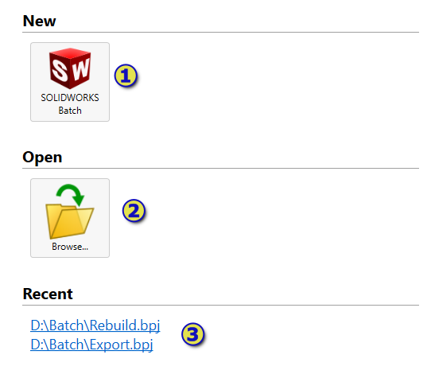
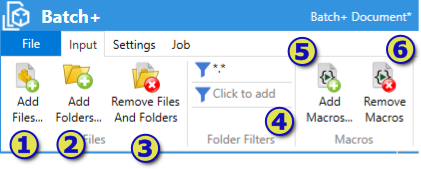
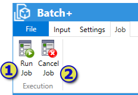
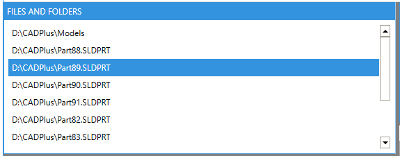
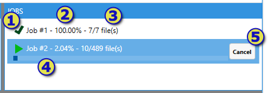
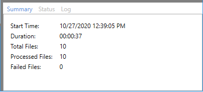
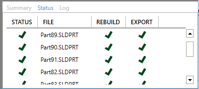

User Interface provides a visual way to configure the batch process.

Batch document (*.bpj) can be saved and loaded from the external files. 

Batch+ document behaves similar to other file based applications (e.g. office, SOLIDWORKS, etc.). If it has unsaved changes it will be marked with * symbol. Additionally Batch+ has quick access menu in the document title header.

Once the batch process is run it creates job. It is possible to run multiple jobs in parallel in a single session.

1. Document title with unsaved mark
1. Save document quick access command
1. Run job quick access command

## Welcome Screen

{ width=400 }

Welcome screen is displayed on the start of the application or when there is no opened documents.

1. New files creation area
1. Open files
1. Recent files list. If file cannot be opened (e.g. corrupted or does not exist - it will be automatically removed from the recent files list.) Limit of recent files list is 5 files.

## Backstage

Backstage panel is available when **File** command is clicked in the ribbon toolbar.

1. Return to main screen
1. Create new document. 
1. Open existing document
1. Save current document
1. Save current document as new file
1. Close active document
1. Navigate to help web page
1. Open About dialog

> When creating new document or opening existing one while there is an active document, command will open new window.

## Ribbon

Batch document can be configured by accessing he options in the ribbon

### Input

User can set the processing scope (files, folders, macros and filters) in this group. Alternatively files, folders and macros can be added to the scope by drag-n-rop directly to corresponding panels.

1. Add files to existing scope. Multiple files can be selected. This button will open the file browse dialog
1. Add folders to existing scope. Multiple folders can be selected. This button will open the folder browse dialog
1. Remove files and folders. Removes the selected files or folders from the scope
1. Folder filters. List of filters to use for selecting files from the folder items selected into the scope. You can use a * wildcard, e.g. \*.sld\* will filter all SOLIDWORKS files (.sldprt, .slddrw and .sldasm) and exclude all other files types. Multiple filters are supported. Click to add new filter. Select and hit **Del** button to remove filter from the list.
1. Add macros. Adds macros to the current macro scope
1. Remove macros. Removes selected macros from the current macro scope.

### Settings

Document settings can be controlled in the settings group.

1. Version of SOLIDWORKS to launch for opening files and running macros
1. Safe startup options - runs SOLIDWORKS in safe mode bypassing options. If this option is selected none of the add-ins will be loaded to the session of SOLIDWORKS
1. Background startup - runs SOLIDWORKS in background. This option only available for SOLIDWORKS Professional or higher
1. Silent startup option - runs SOLIDWORKS and with disabled popup messages and splash screen
1. Hidden startup option - hides SOLIDWORKS window. This can improve performance however some of the API might not work properly in this mode
1. Silent file open option - suppresses all popup dialogs, such as missing references when opening file
1. Rapid file open option - open files in a rapid mode:
    * For drawings - opens in detailing mode. Some of the APIs might not be available in this mode
    * For assemblies - components are loaded lightweight
    * For parts - currently not supported and will be ignored
1. Invisible mode. Allows to open all files invisibly. This significantly improves the performance however some of the API might not be accessible. Macro need to access arguments to connect to the target document as active model will not be available due to it was opened in invisible mode. Read [Model pointer in invisible mode](#model-pointer-in-invisible-mode) for more information
1. Read Only file open option - open files in read-only mode ensuring it cannot be overwritten
1. Forbid Files Upgrade - allows to forbid upgrade of the file if it is of a later version than the SOLIDWORKS. SOLIDWORKS is backward compatible, but not forward compatible which means that files cannot be opened in the older version of SOLIDWORKS. This option checks if current session of SOLIDWORKS is newer than the file and rejects saving operation if this is the case. It is recommended to keep this option selected unless it is explicitly required to upgrade files.
1. Automatically Save Documents - this option will perform the save of the document after each macro run
1. Processing timeout in seconds for processing a single file
1. Allows batch process to continue if any of the files failed to process (for example file cannot be opened). If this option is not checked, batch process will be terminated once the error appears.
1. Batch size - maximum number of files allowed to process within single session of SOLIDWORKS. Once this maximum is reached Batch+ automatically restarts SOLIDWORKS and continues to process files. This option allows to release resources and improve the performance of batch operations.

#### Model pointer in invisible mode

Most VBA macros will connect to active SOLIDWORKS model and perform the operation. The code will look like this:

~~~ vb jagged-bottom
Dim swApp As SldWorks.SldWorks
Dim swModel As SldWorks.ModelDoc2
~~~

~~~ vb jagged
Set swModel = swApp.ActiveDoc
~~~

When invisible mode is selected document is opened hidden thus the ISldWorks::ActiveDoc API will return Nothing as there is no active visible document.

In this case it is required to access the pointer to the model from the arguments passed from Batch+ to the macro.

~~~ vb jagged
Dim macroRunner As Object
Set macroRunner = CreateObject("CadPlus.MacroRunner.Sw")

Dim param As Object
Set param = macroRunner.PopParameter(swApp)

Dim swModel As SldWorks.ModelDoc2
Set swModel = param.Get("Model")
~~~

### Job

Jobs can be controlled in the Job group

1. Run new job. Multiple jobs can be run per document
1. Cancel selected job

## Files And Folders

This panel defines list of files and folders to process. Drag-n-drop files and folders directly to the panel or use [input group in ribbon](#input) to add items with browse dialogs.

Select items and hit **Del** button to remove them from the scope.

## Macros

1. Path to the macro
2. Optional macro arguments

This panel defines list of macros to run on each file. Drag-n-drop macros directly to the panel or use [input group in ribbon](#input) to add macros with browse dialogs.

Select items and hit **Del** button to remove macros from the scope.

Specify the arguments in the command line format if macro supports ones. Follow [Macro Arguments](/macro-arguments/) article of the instructions of how to use macro arguments.

## Jobs

This list contains all jobs which were run or currently running in the active session. Active jobs can be cancelled by pressing the **Cancel** button.

1. Job status (active, completed, failed, cancelled, completed with warnings) is displayed as an icon.
1. Progress value
1. Number of processed files and total files
1. Progress bar of an active job
1. Cancel active job

Select job to get more information in the panel below.

## Job Information

Job information displays additional information about job once selected in the [jobs panel](#jobs)

### Summary

Displays overview information about a job, such as start time, duration, total number of files, failed and successfully processed files. For the running job this information is dynamically updated.

### Status

Contains detailed breakdown for each file and macro. Icon corresponds to the status of the particular item: successfully processed, failed, processed with warnings, or queued to process.

Each column of the grid can be sorted to quickly identify failed items if needed.

### Log

List contains detailed log messages about the progress. Use this log to troubleshoot errors.